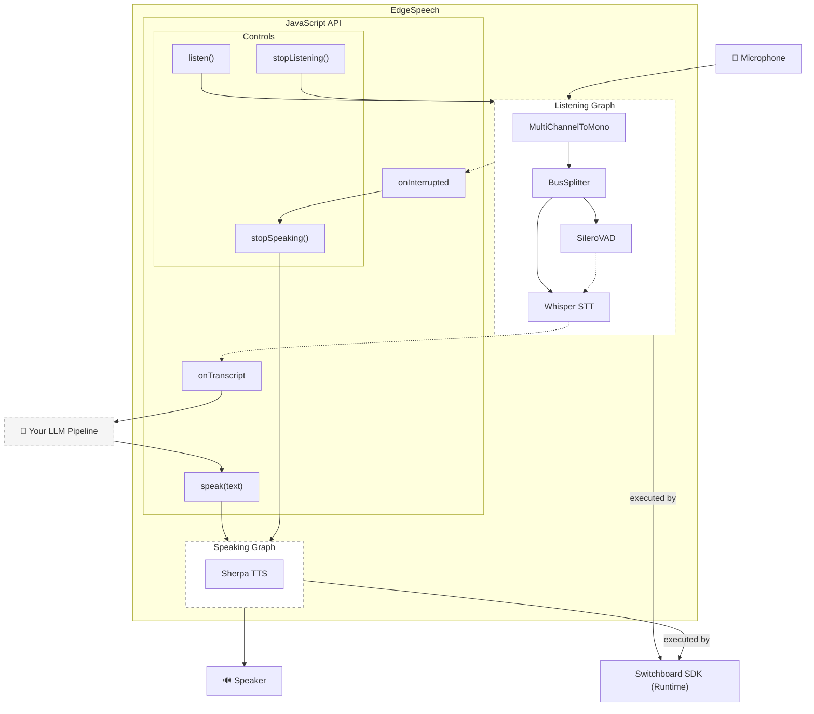

# EdgeSpeech

Web developers can add listening, speaking, or both to a React Native app with EdgeSpeech, without writing any native audio code. Voice Activity Detection, Speech-to-Text, and Text-to-Speech all run on-device through the [Switchboard SDK](https://switchboard.audio/). Your JavaScript works entirely with text.

```typescript
import { SwitchboardVoiceModule, initialize, listen, speak } from '@synervoz/edgespeech'

initialize('YOUR_APP_ID', 'YOUR_APP_SECRET')

SwitchboardVoiceModule.addListener('onTranscript', async ({ text, isFinal }) => {
  if (isFinal) {
    const response = await chat(text)
    await speak(response)
  }
})

await listen()
```

The [example app](./example/) shows the complete voice loop running end-to-end.

## Cost Savings: 99% Cheaper Than Cloud Speech-to-Speech

The real advantage of on-device voice processing is **cost**.

### The Math

Consider a voice AI assistant handling 1,000 conversations per day, each lasting 5 minutes.

**OpenAI Realtime API (cloud speech-to-speech):**
| Component | Calculation | Cost |
|-----------|-------------|------|
| Audio input | 150 sec × 80 tokens/sec × $100/1M | $1.20 |
| Audio output | 150 sec × 80 tokens/sec × $200/1M | $2.40 |
| **Per conversation** | | **$3.60** |
| **1,000 conversations/day** | | **$3,600/day** |
| **Monthly (30 days)** | | **$108,000** |

**EdgeSpeech + ChatGPT API (text only):**
| Component | Calculation | Cost |
|-----------|-------------|------|
| Text input | ~750 tokens × $5/1M | $0.004 |
| Text output | ~750 tokens × $20/1M | $0.015 |
| **Per conversation** | | **$0.02** |
| **1,000 conversations/day** | | **$20/day** |
| **Monthly (30 days)** | | **$600** |

## Installation

```bash
npm install @synervoz/edgespeech
```

### iOS Setup — Expo (managed or bare)

1. The Switchboard SDK frameworks are downloaded automatically when you run `npm install`. No separate setup command is needed.

2. Add microphone permission to your `Info.plist` (or via `app.json` `infoPlist` for Expo managed workflow):

```xml
<key>NSMicrophoneUsageDescription</key>
<string>This app needs microphone access for voice input</string>
```

3. Build your app:

```bash
npx expo run:ios
```

### iOS Setup — Bare React Native (without Expo)

EdgeSpeech uses [`expo-modules-core`](https://docs.expo.dev/bare/installing-expo-modules/) as its native module bridge. You need this package even in a project that otherwise does not use Expo.

1. Install `expo-modules-core`:

```bash
npm install expo-modules-core
```

2. Run `npm install @synervoz/edgespeech`. The Switchboard SDK frameworks download automatically — no separate setup script is needed.

3. Add the Expo autolinking require to the top of `ios/Podfile`, before any `target` blocks:

```ruby
require File.join(
  File.dirname(`node --print "require.resolve('expo-modules-core/package.json')"`),
  "scripts/autolinking"
)
```

4. Inside your main app target, call `use_expo_modules!`:

```ruby
target 'YourApp' do
  use_expo_modules!
  # ... your other pods
end
```

`use_expo_modules!` discovers all installed packages that include an `expo-module.config.json` (including EdgeSpeech) and links them automatically.

5. Install pods:

```bash
cd ios && pod install
```

6. Add microphone permission to `ios/YourApp/Info.plist`:

```xml
<key>NSMicrophoneUsageDescription</key>
<string>This app needs microphone access for voice input</string>
```

7. Build your app:

```bash
npx react-native run-ios
# or open ios/YourApp.xcworkspace in Xcode
```

## Quick Start

```typescript
import {
  SwitchboardVoiceModule,
  initialize,
  configure,
  listen,
  speak,
  requestMicrophonePermission,
} from '@synervoz/edgespeech'

// 1. Initialize with your Switchboard credentials
initialize('YOUR_SWITCHBOARD_APP_ID', 'YOUR_SWITCHBOARD_APP_SECRET')

// 2. (Optional) tune settings
configure({ vadSensitivity: 0.5 })

// 3. Set up event listeners
SwitchboardVoiceModule.addListener('onTranscript', ({ text, isFinal }) => {
  console.log(isFinal ? 'Final:' : 'Interim:', text)
  if (isFinal) handleUserSpeech(text)
})

SwitchboardVoiceModule.addListener('onStateChange', ({ state }) => {
  console.log('State:', state) // 'idle' | 'listening' | 'speaking'
})

SwitchboardVoiceModule.addListener('onInterrupted', () => {
  console.log('User interrupted playback')
})

SwitchboardVoiceModule.addListener('onError', ({ code, message }) => {
  console.error('Voice error:', code, message)
})

// 4. Request permission and start
const granted = await requestMicrophonePermission()
if (granted) {
  await listen()
}

// 5. Speak responses
await speak('Hello! How can I help you today?')
```

## API Reference

### Configuration

```typescript
await EdgeSpeech.configure({
  appId: string,           // Required: Switchboard app ID
  appSecret: string,       // Required: Switchboard app secret
  sttModel?: string,       // Optional: STT model (default: 'whisper-base-en')
  ttsVoice?: string,       // Optional: TTS voice (default: 'en_GB')
  vadSensitivity?: number, // Optional: VAD sensitivity 0.0-1.0 (default: 0.5)
});
```

### Methods

| Method                          | Description                              |
| ------------------------------- | ---------------------------------------- |
| `configure(config)`             | Initialize with credentials and settings |
| `listen()`                      | Start listening for voice input          |
| `stopListening()`               | Stop listening                           |
| `speak(text)`                   | Speak text using TTS                     |
| `stopSpeaking()`                | Stop current TTS playback                |
| `requestMicrophonePermission()` | Request microphone access                |

## Example App

The `example/` directory contains a minimal demo showing the complete voice loop:

```bash
cd example
npm install
npx expo run:ios
```

### Demo Token

The example app ships with a built-in demo `APP_ID` and `APP_SECRET` so you can run it immediately without creating a Switchboard account. This token is provided for evaluation only and **may be rotated or revoked at any time** — do not use it in a production app. Replace it with your own credentials from [console.switchboard.audio](https://console.switchboard.audio/register) before shipping.

## Architecture



## Platform Support

| Platform | Status      |
| -------- | ----------- |
| iOS      | Supported   |
| Android  | Coming soon |

## Requirements

| Requirement       | Minimum | Notes                                                                                                          |
| ----------------- | ------- | -------------------------------------------------------------------------------------------------------------- |
| React Native      | 0.74+   | Declared in `peerDependencies`; not enforced at install time                                                   |
| iOS               | 13.4+   | Enforced by the podspec (`s.platforms = { :ios => "13.4" }`)                                                   |
| Node.js           | 20+     | Required for all tooling; `engines` field in `package.json` specifies `>=22`                                   |
| expo-modules-core | 2.0.0+  | Required peer dependency; included automatically with Expo, must be installed explicitly for bare React Native |

## Get Switchboard Credentials

1. Sign up at [switchboard.audio](https://console.switchboard.audio/register)
2. Create a new app in the dashboard
3. Copy your App ID and App Secret

## Credential Security

Your Switchboard `APP_ID` and `APP_SECRET` are **safe to bundle in your application**. They function like a publishing key and are intended to be distributed with your app.

These credentials identify your application to the Switchboard SDK runtime. They do not grant access to any backend system, user data, or billing controls beyond your own app's usage quota. There is no equivalent "secret key" that must be kept private.

You can commit them to source control, include them in your app bundle, or pass them at build time via environment variables.

## Pricing and Quotas

See the full pricing details at [switchboard.audio/pricing](https://switchboard.audio/pricing/).

**Free Prototyping License** — no cost for apps with fewer than 20,000 cumulative SDK activations. Suitable for development, testing, and early App Store releases.

**Commercial License** — required once your app exceeds 20,000 cumulative activations. Contact [licensing@synervoz.com](mailto:licensing@synervoz.com) before your app reaches that threshold.

## Releasing

Releases are published to npm automatically when a version tag is pushed. Versions follow [Semantic Versioning](https://semver.org/): `MAJOR.MINOR.PATCH` — increment `MAJOR` for breaking changes, `MINOR` for new features, `PATCH` for bug fixes.

1. Bump the version in `package.json`.
2. Commit: `git commit -am "chore: release vX.Y.Z"`
3. Tag and push:

```bash
git tag vX.Y.Z
git push origin main --tags
```

The [release workflow](.github/workflows/release.yml) builds the package and publishes to npm under the `@synervoz` scope using `npm publish --access public`. Requires an `NPM_TOKEN` secret configured in the repository settings.

## Tests

Run unit tests with:

```bash
npm test
```

## License

**EdgeSpeech** - the JavaScript, TypeScript, and Swift source files in this repository are released under the [MIT License](./LICENSE).

**Switchboard SDK frameworks** are downloaded at install time and are proprietary software subject to the [Switchboard SDK Master License Agreement](https://switchboard.audio/licensing/). Key terms for production use:

- **Free Prototyping License** - no cost for apps with fewer than 20,000 cumulative SDK activations. Allows public release including on the iOS App Store.
- **Commercial License** - required once your app exceeds 20,000 cumulative activations. Contact [licensing@synervoz.com](mailto:licensing@synervoz.com) before your app reaches that threshold.
- Apps using the Prototyping License must include the following attribution in app credits:
  > [App Name] uses the Switchboard SDK by Synervoz (Synervoz.com)
- The SDK may not be sublicensed or incorporated into another platform, SDK, or API without written permission from Synervoz.
- Synervoz may disable access without notice if license terms are exceeded.

The full Switchboard SDK license text is downloaded to `ios/Frameworks/SwitchboardSDK/ios/LICENSE.txt` when you run `npm install` and is also available at [switchboard.audio/licensing](https://switchboard.audio/licensing/).

**AI model weights** (Whisper STT, Silero VAD, Sherpa TTS) are bundled inside the Switchboard SDK frameworks under their own open-source licenses: Whisper.cpp (MIT), Silero VAD (MIT), and Sherpa-ONNX (Apache 2.0). Their full license texts are included in the downloaded framework packages.

## Links

- [Switchboard SDK Documentation](https://docs.switchboard.audio/)
- [Example App](./example/)
- [GitHub Issues](https://github.com/switchboard-sdk/EdgeSpeech/issues)
