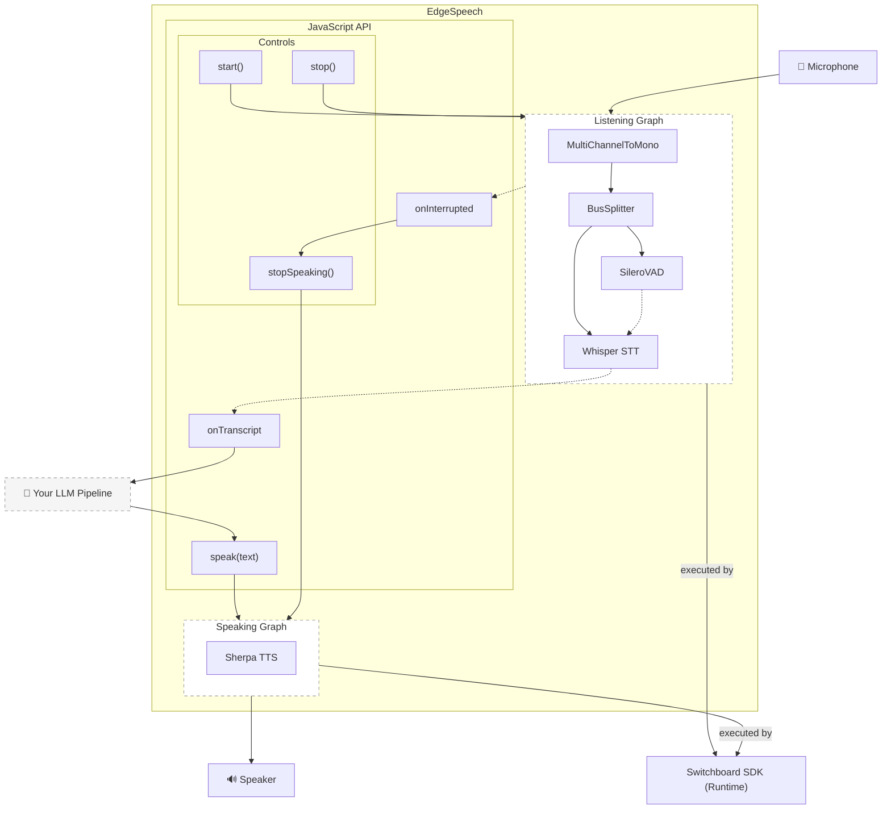

# EdgeSpeech

Web developers can add listening, speaking, or both to a React Native app with EdgeSpeech, without writing any native audio code. Voice Activity Detection, Speech-to-Text, and Text-to-Speech all run on-device through the [Switchboard SDK](https://switchboard.audio/). Your JavaScript works entirely with text.

```typescript
import { SwitchboardVoiceModule, initialize, start, speak } from '@synervoz/edgespeech';

initialize('YOUR_APP_ID', 'YOUR_APP_SECRET');

SwitchboardVoiceModule.addListener('onTranscript', async ({ text, isFinal }) => {
  if (isFinal) {
    const response = await chat(text);
    await speak(response);
  }
});

await start();
```

The [example app](./example/) shows the complete voice loop running end-to-end.

## Cost Savings: 99% Cheaper Than Cloud Speech-to-Speech

The real advantage of on-device voice processing is **cost**.

### The Math

Consider a voice AI assistant handling 1,000 conversations per day, each lasting 5 minutes.

**OpenAI Realtime API (cloud speech-to-speech):**
| Component | Calculation | Cost |
|-----------|-------------|------|
| Audio input | 150 sec × 80 tokens/sec × $100/1M | $1.20 |
| Audio output | 150 sec × 80 tokens/sec × $200/1M | $2.40 |
| **Per conversation** | | **$3.60** |
| **1,000 conversations/day** | | **$3,600/day** |
| **Monthly (30 days)** | | **$108,000** |

**EdgeSpeech + ChatGPT API (text only):**
| Component | Calculation | Cost |
|-----------|-------------|------|
| Text input | ~750 tokens × $5/1M | $0.004 |
| Text output | ~750 tokens × $20/1M | $0.015 |
| **Per conversation** | | **$0.02** |
| **1,000 conversations/day** | | **$20/day** |
| **Monthly (30 days)** | | **$600** |


## Installation

```bash
npm install @synervoz/edgespeech
```

### iOS Setup

1. The Switchboard SDK frameworks are downloaded automatically on `npm install`.

2. Add microphone permission to your `Info.plist`:
```xml
<key>NSMicrophoneUsageDescription</key>
<string>This app needs microphone access for voice input</string>
```

3. Build your app:
```bash
npx expo run:ios
```

## Quick Start

```typescript
import {
  SwitchboardVoiceModule,
  initialize,
  configure,
  start,
  speak,
  requestMicrophonePermission,
} from '@synervoz/edgespeech';

// 1. Initialize with your Switchboard credentials
initialize('YOUR_SWITCHBOARD_APP_ID', 'YOUR_SWITCHBOARD_APP_SECRET');

// 2. (Optional) tune settings
configure({ vadSensitivity: 0.5 });

// 3. Set up event listeners
SwitchboardVoiceModule.addListener('onTranscript', ({ text, isFinal }) => {
  console.log(isFinal ? 'Final:' : 'Interim:', text);
  if (isFinal) handleUserSpeech(text);
});

SwitchboardVoiceModule.addListener('onStateChange', ({ state }) => {
  console.log('State:', state); // 'idle' | 'listening' | 'speaking'
});

SwitchboardVoiceModule.addListener('onInterrupted', () => {
  console.log('User interrupted playback');
});

SwitchboardVoiceModule.addListener('onError', ({ code, message }) => {
  console.error('Voice error:', code, message);
});

// 4. Request permission and start
const granted = await requestMicrophonePermission();
if (granted) {
  await start();
}

// 5. Speak responses
await speak('Hello! How can I help you today?');
```

## API Reference

### Configuration

```typescript
await EdgeSpeech.configure({
  appId: string,           // Required: Switchboard app ID
  appSecret: string,       // Required: Switchboard app secret
  sttModel?: string,       // Optional: STT model (default: 'whisper-base-en')
  ttsVoice?: string,       // Optional: TTS voice (default: 'en_GB')
  vadSensitivity?: number, // Optional: VAD sensitivity 0.0-1.0 (default: 0.5)
});
```

### Methods

| Method | Description |
|--------|-------------|
| `configure(config)` | Initialize with credentials and settings |
| `start()` | Start listening for voice input |
| `stop()` | Stop listening |
| `speak(text)` | Speak text using TTS |
| `stopSpeaking()` | Stop current TTS playback |
| `requestMicrophonePermission()` | Request microphone access |

### Events

Listen via `SwitchboardVoiceModule.addListener(eventName, handler)`.

| Event | Payload | Description |
|-------|---------|-------------|
| `onTranscript` | `{ text: string, isFinal: boolean }` | Speech recognized |
| `onStateChange` | `{ state: string }` | State changed (`idle`, `listening`, `speaking`) |
| `onSpeechStart` | `{}` | VAD detected voice activity |
| `onSpeechEnd` | `{}` | VAD detected end of speech |
| `onTTSComplete` | `{}` | TTS finished playing |
| `onInterrupted` | `{}` | TTS interrupted by user speech |
| `onError` | `{ code: string, message: string }` | Error occurred |

### States

```
idle -> listening -> processing -> idle
                 \              /
                   -> speaking -
```

## Example App

The `example/` directory contains a minimal demo showing the complete voice loop:

```bash
cd example
npm install
npx expo run:ios
```

## Architecture




## Platform Support

| Platform | Status |
|----------|--------|
| iOS | Supported |
| Android | Coming soon |

## Requirements

- React Native 0.74+
- iOS 13.4+
- Node.js 20+

## Get Switchboard Credentials

1. Sign up at [switchboard.audio](https://console.switchboard.audio/register)
2. Create a new app in the dashboard
3. Copy your App ID and App Secret

## License

MIT

## Links

- [Switchboard SDK Documentation](https://docs.switchboard.audio/)
- [Example App](./example/)
- [GitHub Issues](https://github.com/switchboard-sdk/EdgeSpeech/issues)
